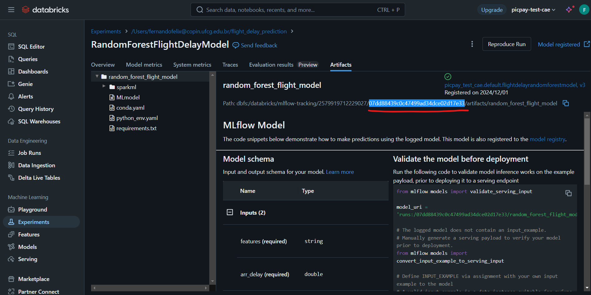

# Case Machine Learning Engineer

# Escopo

Este teste consiste em criar uma solução de transformação de dados, treino de modelo e escoragem online. Para isso deverá ser entregue um **link de um repositório Git** (GitHub, BitBucket, etc.) contendo a seguinte estrutura:

* **/src/** - Códigos da API
* **/notebook/** - Contém o arquivo notebook com as transformações do dado, respostas das perguntas e treinamento do modelo
* **/docs/** - Desenho da arquitetura
* **/tests/** - Testes unitários

Abaixo estão as regras/orientações para a entrega:

* Você terá **15 dias corridos** a partir do recebimento deste email para fazer a entrega final via `Github`, em um repositório público e o link do repositório deverá ser enviado para a plataforma Gupy em resposta ao email de recebimento do desafio;
* Durante todo o período o **time estará disponível** para dúvidas no email `data.mlops@picpay.com`;
* O foco do teste é avaliar como você se sai em um desafio de rotinas de Engenheiro de Machine Learning bem como você lida ao aprender novas tecnologias;
* Caso não consiga terminar 100% do proposto, recomendamos que faça as entregas mesmo assim para que o time possa avaliar seu desempenho;
* O uso de ferramentas como **Google** e **ChatGPT** é permitido porém, iremos avaliar e questionar a solução entregue durante a entrevista técnica;

## CheckList de Entrega

* A API deverá ser feita em **Python** e Conteinerizada no docker. A API deverá ter os seguintes endpoints:
    * `/model/predict/`
        * Endpoint onde deverá receber um payload com as informações do voo e retornar a previsão do atraso no destino
    * `/model/load/`
        * Endpoint onde deverá receber o arquivo .pkl do modelo e deixar a API pronta para realizar predições
    * `/model/history/`
        * Endpoint onde deverá exibir o histórico de predições realizadas (o payload de entrada + as saídas preditas)
    * `/health/`
        * Endpoint que irá retornar a saúde da API
* O Notebook deverá ser exportado no formato **.ipynb **e estar dentro do repositório git.
    * Deverá realizar as transformações utilizando spark:
    * Responder o conjunto de perguntas contidas nesse documento
* **Desenho** da arquitetura:
    * Apresentar um desenho simples de como essa arquitetura poderia funcionar dentro de um ambiente Cloud;
    * O desenho da arquitetura pode ser apenas uma **imagem** (.png, .jpg)

**Você deverá apresentar a solução durante a entrevista técnica**

# Uso

Arquitetura: https://drive.google.com/file/d/1StNi278qbjfBc4MO7TwZRaQr5WGPxkWw/view?usp=sharing

1. Treine o modelo no Databricks
  - Upload notebook/training.ipynb para o databricks
  - Criar um cluster databricks: Databricks Runtime 15.4 LTS
  - Executar todas as celulas do notebook para treinar o modelo e salvar no MLFlow
  - Salve a URI do modelo: Experiments -> flight_delay_prediction -> Selecionar última execução -> Artifacts -> Salve Run ID

Exemplo de Run ID:

2. Crie container e execute, passando variáveis de ambiente como parâmetros
´´´
docker build -t databricks-mlflow-api .
docker run  -p 8000:8000 -e DATABRICKS_HOST=https://<subdomain>.cloud.databricks.com/ -e DATABRICKS_TOKEN=<token> -e MLFLOW_RUN_ID=<run_id> databricks-mlflow-api
´´´
